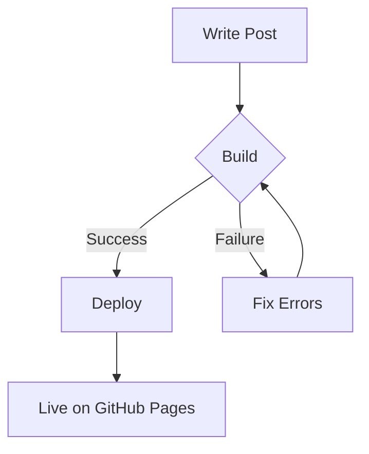
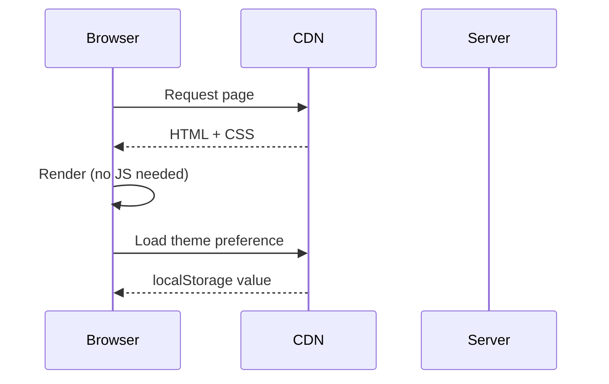

This post exists to showcase every visual element the blog supports. Think of it as a living style guide  - if something looks off here, it needs fixing.

## Headings

The heading hierarchy uses JetBrains Mono with decreasing sizes. All monospace, all the time.

### Third-level heading

Used for subsections within a topic. Still prominent but clearly subordinate.

#### Fourth-level heading

For fine-grained organization. Rarely needed, but available.

## Text Formatting

Regular paragraph text is set in JetBrains Mono at 15px with generous line-height. The monospace aesthetic means every character takes the same space  - readable but with character.

Here's **bold text** for emphasis, *italic text* for tone, and ***bold italic*** when you really mean it. You can also use `inline code` for technical terms like `useState` or `docker-compose.yml`.

Sometimes you need to ~~strike through~~ a thought. And sometimes you need a [link to somewhere](https://github.com/snehilvj) to reference external content.

## Blockquotes

> The best code is no code at all. Every line of code you write is a line that needs to be maintained, debugged, and understood by the next person.

Blockquotes get a warm amber accent border, an elevated background with rounded corners. They should feel like a pull-quote or a notable aside.

> **Nested emphasis works too.**
>
> Multi-paragraph blockquotes maintain their styling throughout. Use them for extended quotes, important callouts, or philosophical asides.

## Lists

### Unordered lists

- First item  - the basics
- Second item with some **bold** and `code`
- Third item that's a bit longer to show how line wrapping looks when the content extends beyond a single line in the layout
- Nested items work too:
  - Sub-item one
  - Sub-item two
  - Sub-item three

### Ordered lists

1. Install dependencies
2. Configure the project
3. Write your content
4. Deploy to production
5. Never touch it again (just kidding)

### Mixed nesting

1. **Set up the project**
   - Clone the repository
   - Run `pnpm install`
   - Create your `.env` file
2. **Configure content**
   - Add posts to `src/content/blog/`
   - Update `src/config.ts` with your details
3. **Deploy**
   - Push to `main` branch
   - GitHub Actions handles the rest

## Code Blocks

### JavaScript / TypeScript

```typescript
interface BlogPost {
  title: string;
  description: string;
  pubDate: Date;
  tags: string[];
  draft?: boolean;
}

async function getSortedPosts(): Promise<BlogPost[]> {
  const posts = await getCollection('blog', ({ data }) => !data.draft);
  return posts.sort((a, b) => b.data.pubDate.valueOf() - a.data.pubDate.valueOf());
}

// Arrow functions with ligatures: => !== === >=
const filterByTag = (posts: BlogPost[], tag: string) =>
  posts.filter((post) => post.data.tags.includes(tag));
```

### Python

```python
from dataclasses import dataclass
from datetime import datetime
from typing import Optional

@dataclass
class BlogPost:
    title: str
    description: str
    pub_date: datetime
    tags: list[str]
    draft: bool = False
    hero_image: Optional[str] = None

    @property
    def reading_time(self) -> str:
        words = len(self.content.split())
        minutes = max(1, words // 225)
        return f"{minutes} min read"

    def __repr__(self) -> str:
        return f"<Post: {self.title}>"
```

### Bash / Shell

```bash
# Deploy to production
#!/bin/bash
set -euo pipefail

echo "Building site..."
pnpm run build

echo "Deploying to GitHub Pages..."
git add dist/
git commit -m "deploy: $(date +%Y-%m-%d)"
git push origin main

echo "Done! Site is live."
```

### CSS

```css
:root {
  --color-accent: #e2a052;
  --font-mono: 'JetBrains Mono', monospace;
  --transition-base: 200ms ease-out;
}

.post-card {
  padding: var(--space-5) 0;
  border-bottom: 1px solid var(--color-separator);
  transition: color var(--transition-fast);
}

.post-card:hover .post-card__title {
  color: var(--color-accent);
}
```

### JSON

```json
{
  "name": "thoughts",
  "version": "0.0.1",
  "type": "module",
  "scripts": {
    "dev": "astro dev",
    "build": "astro build",
    "preview": "astro preview"
  }
}
```

### Inline code in context

When you run `pnpm run dev`, the server starts on `http://localhost:4321`. The `astro.config.mjs` file controls the `site` URL and `base` path. Use `import.meta.env.BASE_URL` to reference it in templates.

## Tables

| Feature | Status | Notes |
|---------|--------|-------|
| Dark mode | Done | CSS custom properties + localStorage |
| Tags | Done | Dot-separated, plain text |
| RSS | Done | Auto-generated at `/rss.xml` |
| SEO | Done | OG tags, JSON-LD, sitemap |
| LLM SEO | Done | `llms.txt` + `llms-full.txt` |

### Wider table

| Technology | Purpose | Bundle Size | Why Chosen |
|-----------|---------|-------------|------------|
| Astro | Static site gen | ~0KB client JS | Content-first, fast builds |
| JetBrains Mono | Typography | ~50KB | Monospace with ligatures |
| Shiki | Syntax highlighting | 0KB (build-time) | Built into Astro, dual-theme |
| Vanilla CSS | Styling | ~8KB | Full control, no framework overhead |

## Mermaid Diagrams

The blog supports mermaid diagrams rendered client-side. They adapt to the current theme.

### Flowchart



### Sequence Diagram



## Horizontal Rules

Content before the rule.

---

Content after the rule. Horizontal rules create visual breathing room between distinct sections.

## Images

Images are displayed inline with subtle rounded corners, matching the elevated surface aesthetic used throughout.

## Combining Elements

Here's a realistic scenario combining multiple elements  - a technical explanation:

The blog's theme system works in three layers:

1. **CSS custom properties** define all colors in `:root` (dark default) and `[data-theme='light']`
2. **An inline script** in `<head>` reads `localStorage` before first paint:

```javascript
const stored = localStorage.getItem('theme');
const preferred = window.matchMedia('(prefers-color-scheme: dark)').matches
  ? 'dark'
  : 'light';
document.documentElement.dataset.theme = stored || preferred;
```

> This two-layer approach ensures zero flash of wrong theme and smooth transitions  - all without a framework.

The result is a seamless experience where:

- First visit respects system preference
- Manual toggle persists across sessions
- Code blocks switch between `github-light` and `vitesse-dark` themes

## Long-form Prose

This paragraph is intentionally longer to demonstrate how the blog handles extended prose. Monospace text at 15px with generous line-height and a 680px max-width creates a comfortable reading measure. Every character takes the same space  - which gives prose a distinctive rhythm. It's not how most blogs look, and that's the point.

Good typography isn't about picking fancy fonts. It's about invisible decisions  - line-height, letter-spacing, font-size ratios, measure width  - that make reading feel effortless. Even in monospace, the right spacing makes long-form content feel natural.

---

*That's the full showcase. If you're reading this in dark mode, try switching to light (and vice versa) to see how all elements adapt.*
